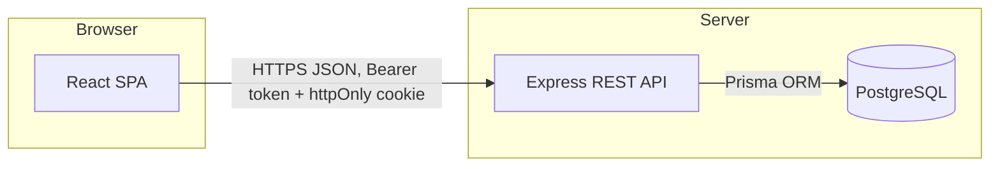

# Vitalis Health — Online Appointment Booking System

A production-grade appointment booking platform: patients search doctors by specialty, see real-time
availability, book a time slot, and manage their appointments — all backed by a REST API with real
double-booking prevention at the database level.

> This is a demonstration project. All doctors, clinics and patients are fictional. No real medical or
> personal data is used.

## Contents

- [Overview](#overview)
- [Architecture](#architecture)
- [Technology stack](#technology-stack)
- [Prerequisites](#prerequisites)
- [Getting started](#getting-started)
- [Environment variables](#environment-variables)
- [Database](#database)
- [Running the app](#running-the-app)
- [Testing](#testing)
- [Production build](#production-build)
- [Project structure](#project-structure)
- [API overview](#api-overview)
- [Key design decisions](#key-design-decisions)
- [Known limitations & future improvements](#known-limitations--future-improvements)

## Overview

**Patient-facing features**

- Browse and search doctors by name or specialty, with sorting (rating, experience, fee) and pagination
- Doctor profile pages with bio, credentials, clinic location and weekly working hours
- A four-step booking wizard: date → time slot → patient details → review & confirm
- Real-time slot availability that accounts for the doctor's schedule, declared days off, and existing bookings
- Instant appointment confirmation with a shareable summary
- "My Appointments" dashboard with Upcoming / Past / Cancelled tabs
- Self-service cancellation, which immediately frees the slot for other patients
- Account registration/login and a profile page for updating contact details

**Engineering features**

- JWT access tokens (in-memory on the client) + rotating, hashed refresh tokens in an `httpOnly` cookie
- Request validation with Zod on both the API and the forms, never trusting the client alone
- A **partial unique database index** that makes double-booking impossible even under concurrent requests
- Centralized API error handling with a consistent response envelope and safe, non-leaking error messages
- Automated test suite (27 tests) covering auth, availability computation, and every booking business rule
- Fully typed end-to-end (TypeScript on both the API and the UI)

## Architecture



The frontend never talks to the database directly — every read and write goes through the versioned REST API,
which owns all validation and business rules. The backend is organized by feature module (`auth`, `doctors`,
`appointments`, ...), each with its own `schemas` (Zod), `service` (business logic / Prisma calls),
`controller` (HTTP glue) and `routes`.

## Technology stack

| Layer | Choice | Why |
|---|---|---|
| Frontend | React 19 + TypeScript + Vite 8 | Fast dev server, first-class TS support, mainstream ecosystem |
| Styling | Tailwind CSS v4 | CSS-first theming (`@theme`), no runtime cost, fast to iterate |
| Routing | React Router 7 | Standard SPA routing with layouts and protected routes |
| Server state | TanStack Query 5 | Caching, dedup, background refetch, loading/error states for free |
| Forms | React Hook Form + Zod | Uncontrolled-input performance with schema-driven validation |
| Backend | Node.js + Express 5 + TypeScript | Ubiquitous, simple, easy to reason about |
| Database | PostgreSQL 17 | Relational integrity, partial indexes, mature tooling |
| ORM | Prisma 6 | Type-safe queries, migrations, and a great DX |
| Auth | JWT + bcrypt + rotating refresh tokens | Stateless access tokens, revocable sessions, no plaintext passwords |
| Testing | Vitest + Supertest | Fast, native ESM/TS support, real HTTP-level API tests |

## Prerequisites

- Node.js ≥ 20.19 and npm ≥ 10
- A PostgreSQL 17 server (local install, or any managed Postgres). No Docker is required or assumed.

## Getting started

```bash
# 1. Install dependencies for both projects
npm run install:all

# 2. Create a dedicated database + role (do NOT use the postgres superuser for the app)
psql -U postgres -c "CREATE ROLE appointment_app LOGIN PASSWORD 'choose-a-strong-password' CREATEDB;"
psql -U postgres -c "CREATE DATABASE appointment_booking OWNER appointment_app;"
psql -U postgres -c "CREATE DATABASE appointment_booking_test OWNER appointment_app;"
# (CREATEDB is only needed so Prisma can manage its migration "shadow" database in dev.)

# 3. Configure environment variables (see below)
cp backend/.env.example backend/.env
cp frontend/.env.example frontend/.env
# edit backend/.env: set DATABASE_URL / TEST_DATABASE_URL and generate real JWT secrets

# 4. Run migrations and seed demo data
npm run db:migrate
npm run db:seed

# 5. Start both servers
npm run dev
```

- Frontend: http://localhost:5173
- Backend API: http://localhost:4000/api
- Demo login: `demo.patient@example.com` / `Patient123`

## Environment variables

### `backend/.env` (see `backend/.env.example`)

| Variable | Description |
|---|---|
| `NODE_ENV` | `development` \| `test` \| `production` |
| `PORT` | API server port (default `4000`) |
| `CORS_ORIGIN` | Comma-separated list of allowed frontend origins |
| `DATABASE_URL` | PostgreSQL connection string for the app database |
| `TEST_DATABASE_URL` | PostgreSQL connection string used only by the test suite |
| `JWT_ACCESS_SECRET` / `JWT_REFRESH_SECRET` | ≥32-character random secrets — generate with `node -e "console.log(require('crypto').randomBytes(48).toString('hex'))"` |
| `JWT_ACCESS_TOKEN_TTL` / `JWT_REFRESH_TOKEN_TTL` | Token lifetimes, e.g. `15m`, `7d` |
| `LOG_LEVEL` | pino log level |

### `frontend/.env` (see `frontend/.env.example`)

| Variable | Description |
|---|---|
| `VITE_API_BASE_URL` | Where the SPA sends API requests. `/api` in development (proxied by Vite to the backend — see `vite.config.ts`); a full URL in production. |

Secrets are never committed — only `.env.example` files are tracked, and real `.env` files are gitignored.

## Database

Schema lives in `backend/prisma/schema.prisma`; migrations in `backend/prisma/migrations`. Key entities:

- **User** — patient/admin accounts (hashed passwords, never plaintext)
- **RefreshToken** — hashed, revocable refresh sessions (enables logout-everywhere and rotation)
- **Specialty** — medical specialty catalog (Cardiology, Dermatology, ...)
- **Doctor** — profile, fee, clinic info, slot duration; belongs to a Specialty
- **WeeklyAvailability** — recurring weekly working-hours template per doctor
- **DoctorTimeOff** — specific dates a doctor is fully unavailable (holidays, leave)
- **Appointment** — the booking itself, with a **patient-details snapshot** (name/email/phone at booking
  time, so later profile edits never rewrite history) and a partial unique index enforcing "no double
  booking" — see [`docs/API.md`](docs/API.md#double-booking-prevention) for details

```bash
npm run db:migrate   # apply migrations (dev)
npm run db:seed      # load specialties, 12 doctors, and demo appointments
```

`backend/prisma/seed.ts` seeds 8 specialties, 12 fictional doctors with realistic weekly schedules, one
sample day-off, and a demo patient account with one upcoming, one completed and one cancelled appointment —
so the app is fully demonstrable immediately after seeding.

## Running the app

```bash
npm run dev          # runs backend (tsx watch) + frontend (Vite) concurrently
```

Or independently:

```bash
npm run dev --prefix backend
npm run dev --prefix frontend
```

## Testing

```bash
npm test             # backend: 27 Vitest + Supertest tests against a real disposable Postgres test DB
npm run lint          # ESLint across both projects
npm run typecheck      # strict TypeScript, both projects
```

The backend test suite covers: registration/login/refresh/logout, profile updates, doctor listing & filtering,
availability computation (including a doctor's declared day off and an already-booked slot), successful
booking, invalid input rejection, booking-in-the-past rejection, out-of-schedule slot rejection,
**double-booking prevention** (same doctor/date/time, and the same patient across two doctors at the same
time), **re-booking after cancellation**, authorization boundaries (can't cancel or view someone else's
appointment), and appointment listing filters.

## Production build

```bash
npm run build         # tsc for the backend, tsc + vite build for the frontend
npm start --prefix backend    # runs the compiled backend from backend/dist
npm run preview --prefix frontend  # preview the built frontend bundle
```

In a real deployment, serve `frontend/dist` from a static host/CDN, run the backend as a long-lived Node
process (or container) with `NODE_ENV=production`, and point `VITE_API_BASE_URL` at the backend's public URL.
See [`docs/DEPLOYMENT.md`](docs/DEPLOYMENT.md) for the actual $0-cost deployment this project uses
(Cloudflare Pages + Render + Neon) and why those providers were chosen.

## Project structure

```
backend/
  prisma/
    schema.prisma        # data model
    migrations/           # SQL migrations (includes the hand-added partial unique index)
    seed.ts                # demo data
  src/
    config/env.ts          # Zod-validated environment configuration
    lib/                    # Prisma client, logger
    middleware/             # auth, validation, rate limiting, centralized error handler
    modules/
      auth/                 # schemas, service, controller, routes
      doctors/
      specialties/
      appointments/
    utils/                  # AppError, slot-generation logic, time helpers, tokens
    app.ts / server.ts
  tests/                    # Vitest + Supertest integration tests

frontend/
  src/
    components/
      ui/                   # Button, Input, Card, Modal, Empty/Error states, ...
      layout/               # Header, Footer, ProtectedRoute
      doctors/ booking/ appointments/
    context/AuthContext.tsx  # in-memory access token + silent refresh
    hooks/                    # TanStack Query hooks per resource
    lib/                       # axios client with refresh interceptor, query client
    pages/                      # one component per route
    utils/                       # formatters, shared Zod form schemas

docs/API.md            # full REST API reference
```

## API overview

See [`docs/API.md`](docs/API.md) for the full endpoint reference, request/response shapes, and the
double-booking-prevention design in detail.

## Key design decisions

- **Dates and times are the clinic's local wall-clock time**, stored as plain calendar dates (`DATE`) and
  `"HH:mm"` strings rather than timezone-aware timestamps. This is a deliberate simplification appropriate
  for a single-region clinic booking system; a multi-timezone deployment would need to store an explicit
  clinic timezone per doctor and convert at the edges.
- **Patient details are snapshotted onto the appointment** at booking time (not just referenced via the
  user's profile), so a later profile edit never silently rewrites a historical booking record.
- **Refresh tokens are opaque random strings, hashed before storage**, rotated on every use, and revocable —
  never a second JWT that can't be invalidated before it expires.
- **Access tokens live only in memory on the client**, not `localStorage`, to reduce XSS blast radius; the
  refresh token is `httpOnly` and scoped to `/api/auth`, so client-side JavaScript never sees it.

## Known limitations & future improvements

- No admin UI for managing doctors/specialties/schedules — they are managed via the seed script; the data
  model already supports it, and an admin module would slot into the existing `modules/` pattern.
- No email/SMS notifications on booking or cancellation (would typically be a queued job in production).
- No automated end-to-end (browser) test suite — the frontend is covered by strict TypeScript, ESLint, and a
  production build check, and the API layer it depends on has full integration coverage; a Playwright suite
  would be a natural next addition.
- The production frontend bundle is a single ~580 KB (175 KB gzip) chunk. Route-level code splitting
  (`React.lazy`) would reduce initial load time further as the app grows.
